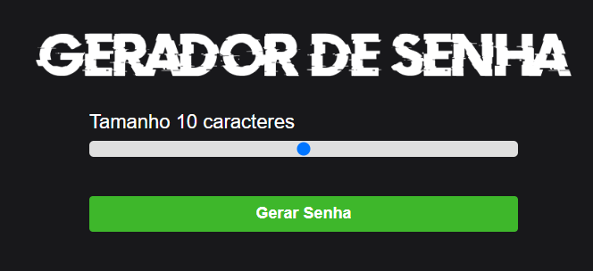
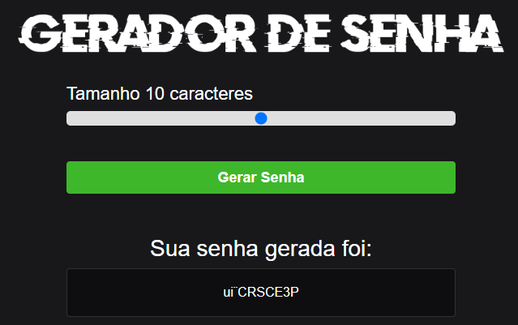

# Gerador de Senhas

### Prints Do Site
### Home:

### Password Generate:

# Descrição

Este projeto é um gerador de senhas seguras que permite criar senhas fortes e aleatórias para proteger suas contas online. O gerador oferece a personalização de comprimento da senha.

# Funcionalidades
Geração de senhas aleatórias: Cria senhas únicas e seguras.
Opções de personalização: Escolha o comprimento da senha.
Interface amigável: Interface simples e fácil de usar.
Copiar para área de transferência: Opção de copiar a senha gerada com um clique.

# Tecnologias Utilizadas
Linguagem: HTML, CSS e JavaScript
